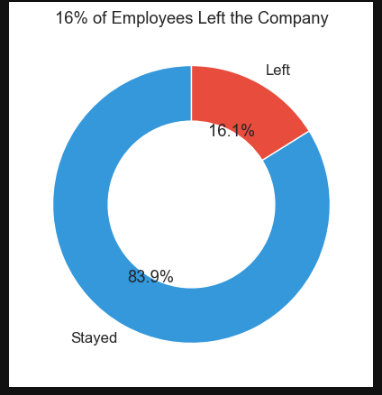
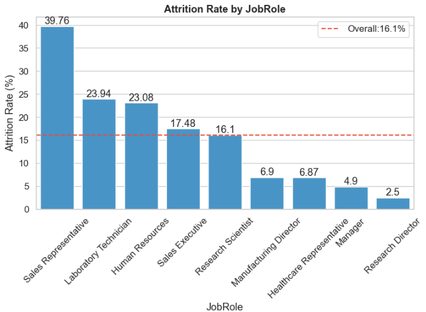
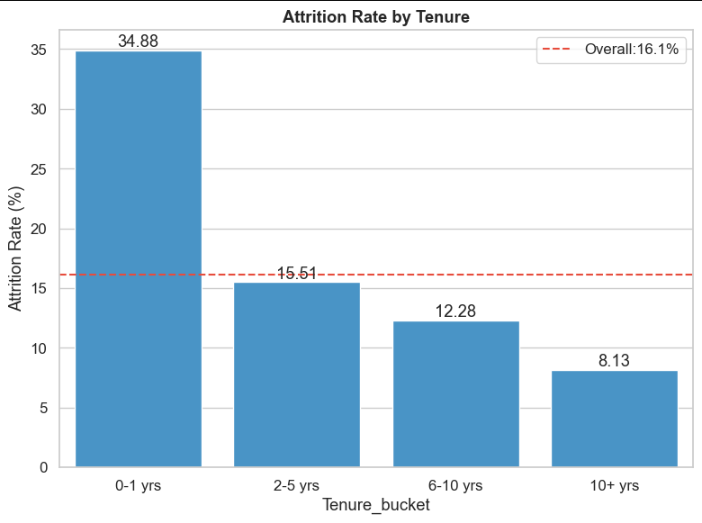
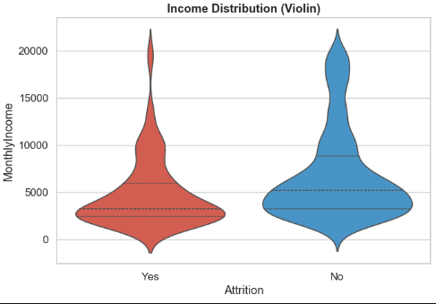
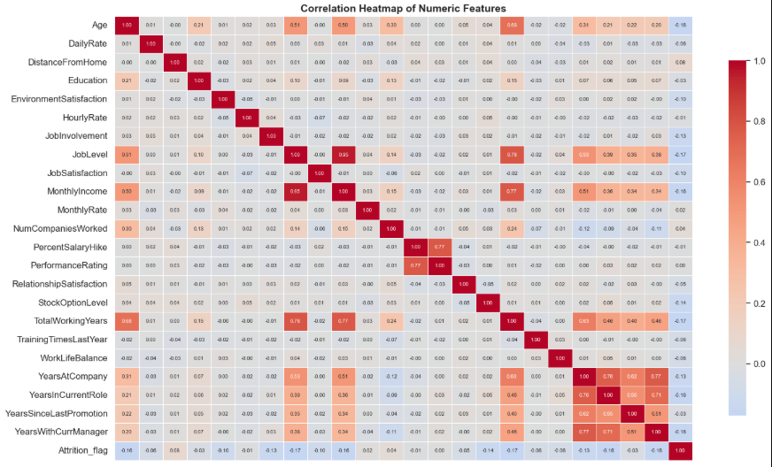

# 👥 HR Employee Attrition: Deep-Dive Analytics & Retention Strategy


> **Why are employees leaving, which segments are at highest risk, and what should HR do about it?**

An end-to-end exploratory and statistical analysis of the IBM HR Analytics dataset. The project goes beyond charts: it **tests whether differences are statistically real**, measures **how strong** each effect is, and turns the findings into **retention recommendations** for HR.



---

## 📌 Key Findings

| # | Finding | Evidence |
|---|---|---|
| 1 | **Overtime is the strongest driver** | 30.5% attrition with overtime vs 10.4% without (about 3x), p < 0.001 |
| 2 | **Sales Representatives leave the most** | 39.8% (33 of 83), versus 16.1% company-wide |
| 3 | **Single employees are higher risk** | 25.5% vs 12.5% (married) and 10.1% (divorced) |
| 4 | **The first year is the riskiest** | 34.9% for 0-1 years, falling to 8.1% for 10+ years |
| 5 | **Leavers are younger and lower-paid** | Avg. age 33.6 vs 37.6; avg. monthly income 4,787 vs 6,833 |
| 6 | **Gender is not a driver** | 17% vs 14.8% gap is not significant (p = 0.29) |

> Overall attrition rate: **16.1%** (237 of 1,470 employees).

---

## 🎯 Business Problem

HR knows that roughly 1 in 6 employees leave, but a single company-wide number cannot guide action. This project answers three questions:

1. **Why** are employees leaving?
2. **Which segments** are highest-risk?
3. **What should HR do** about it?

---

## 📂 Dataset

- **Source:** [IBM HR Analytics Employee Attrition & Performance (Kaggle)](https://www.kaggle.com/datasets/pavansubhasht/ibm-hr-analytics-attrition-dataset)
- **Size:** 1,470 employees, 35 columns
- **Target:** `Attrition` (Yes/No), about 84% No / 16% Yes (imbalanced)

---

## 🔬 Approach

### 1. Setup & Data Quality
- Checked data types, nulls and duplicates (none found)
- Dropped zero-variance and ID columns (`EmployeeCount`, `StandardHours`, `Over18`, `EmployeeNumber`), with the reason explained
- Mapped numeric-coded categories (Education, JobSatisfaction, WorkLifeBalance, etc.) to readable labels
- Flagged class imbalance, so all comparisons use **attrition rates (%)** rather than raw counts

### 2. Univariate & Segment Analysis
- Attrition rate by Department, Job Role, OverTime, Gender, Marital Status and Education Field, each compared against the 16.1% baseline
- Income distribution by attrition status (boxplots and violin plots, not just averages)
- Tenure analysis using buckets (0-1, 2-5, 6-10, 10+ years)

### 3. Statistical Testing
- **Chi-square tests** for categorical features vs attrition, with **Cramér's V** to measure effect size
- **Welch's t-test and point-biserial correlation** for numeric features
- **Correlation heatmap** to detect multicollinearity
- Clear separation of what is *statistically significant* from what only *looks* different

### 4. Findings & Recommendations
- Executive summary, limitations and conclusion (see below)

---

## 📊 Statistical Results

### Categorical features (Chi-square, α = 0.05)

| Feature | p-value | Cramér's V | Result |
|---|---|---|---|
| OverTime | 8.2e-21 | 0.244 | Significant (moderate) |
| JobRole | 2.8e-15 | 0.242 | Significant (moderate) |
| MaritalStatus | 9.5e-11 | 0.177 | Significant (moderate) |
| JobSatisfaction | 5.6e-04 | 0.109 | Significant (weak) |
| EducationField | 6.8e-03 | 0.104 | Significant (weak) |
| Department | 4.5e-03 | 0.086 | Significant (weak) |
| Gender | 0.291 | 0.028 | **Not significant** |

### Numeric features (Welch's t-test + point-biserial)

| Feature | Leavers (mean) | Stayers (mean) | p-value | r |
|---|---|---|---|---|
| MonthlyIncome | 4,787 | 6,833 | 4.4e-13 | -0.160 |
| Age | 33.6 | 37.6 | 1.4e-08 | -0.159 |
| YearsAtCompany | 5.1 | 7.4 | 2.3e-07 | -0.134 |
| DistanceFromHome | 10.6 | 8.9 | 4.1e-03 | +0.078 |

**Takeaway:** OverTime and Job Role are the strongest drivers. Every individual numeric correlation is weak (|r| < 0.2), so attrition comes from a **combination of factors**, not a single cause.

---

## 💡 Retention Recommendations

| Priority | Recommendation | Based on |
|---|---|---|
| 🔴 High | **Audit workload** in overtime-heavy roles; limit routine overtime | Strongest statistical driver, directly controllable by HR |
| 🔴 High | **Exit-interview deep-dive for Sales Representatives** (targets, commission, manager support) | Highest-risk role (39.8%) |
| 🟠 Medium | **Strengthen onboarding**: buddy system, 30/60/90-day check-ins | 34.9% attrition in the first year |
| 🟠 Medium | **Review pay and career paths** for junior employees | Leavers earn less and are younger |
| 🟢 Low | Consider hybrid or remote options for long commutes | Real but very small effect (r = 0.08) |

---

## ⚠️ Limitations

- **Association, not causation:** the tests show which factors are linked to attrition, not that they cause it. Overtime may be a symptom of a deeper issue like understaffing.
- **Income is confounded** with job level and experience, so low pay among leavers partly reflects junior roles.
- **Small groups** (e.g. the Human Resources education field) give unstable rates.
- **Single snapshot** of a well-known sample dataset, not a live company's data, so trends over time cannot be seen.
- **No predictive model:** this project explains attrition; it does not predict individual employees.

---

## 🖼️ Selected Visuals

| Attrition by Job Role | Attrition by Tenure |
|---|---|
|  |  |

| Monthly Income vs Attrition | Correlation Heatmap |
|---|---|
|  |  |

---

## 🛠️ Tech Stack

- **Python:** Pandas, NumPy
- **Visualization:** Matplotlib, Seaborn
- **Statistics:** SciPy (chi-square, Welch's t-test, point-biserial correlation)
- **Environment:** Jupyter Notebook

---

## 📁 Project Structure

```
├── IBM_Employee_Attrition_Analysis.ipynb   # Full analysis notebook
├── WA_Fn-UseC_-HR-Employee-Attrition.csv   # Dataset
├── images/                                 # Charts used in this README
├── requirements.txt
└── README.md
```

---

## ▶️ How to Run

```bash
# 1. Clone the repository
git clone https://github.com/<your-username>/hr-employee-attrition-analytics.git
cd hr-employee-attrition-analytics

# 2. Install dependencies
pip install -r requirements.txt

# 3. Launch the notebook
jupyter notebook IBM_Employee_Attrition_Analysis.ipynb
```

`requirements.txt`:
```
pandas
numpy
matplotlib
seaborn
scipy
jupyter
```

---

## 🧠 Skills Demonstrated

- Data cleaning and quality checks
- Segment analysis against a baseline
- Hypothesis testing (chi-square, t-test) with effect sizes
- Handling class imbalance in interpretation
- Translating statistical findings into business recommendations

---

## 👤 Author

**Yuvraj**
🔗 [LinkedIn](https://www.linkedin.com/in/yuvrajrathore54)

*If you found this project useful, consider giving it a ⭐*
